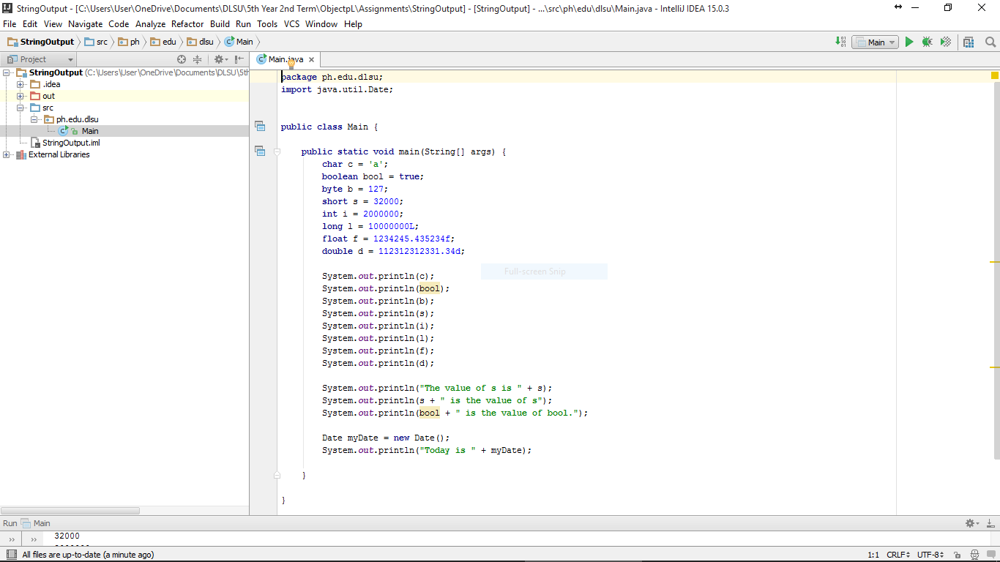
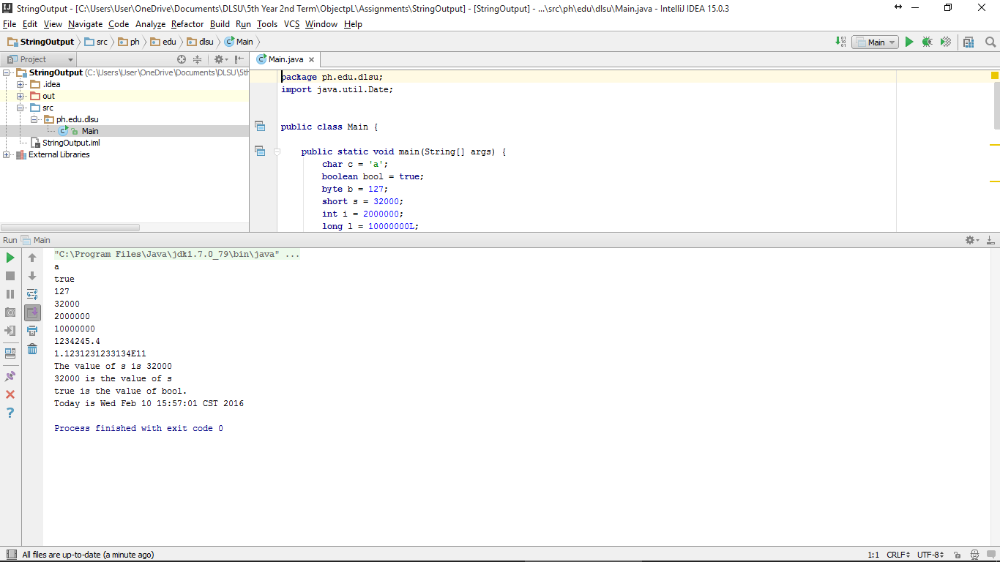

#StringOutput

Printing of strings

#ScreenShots

#Code

~~~
package ph.edu.dlsu;
import java.util.Date;

public class Main {

    public static void main(String[] args) {
        char c = 'a';
        boolean bool = true;
        byte b = 127;
        short s = 32000;
        int i = 2000000;
        long l = 10000000L;
        float f = 1234245.435234f;
        double d = 112312312331.34d;

        System.out.println(c);
        System.out.println(bool);
        System.out.println(b);
        System.out.println(s);
        System.out.println(i);
        System.out.println(l);
        System.out.println(f);
        System.out.println(d);

        System.out.println("The value of s is " + s);
        System.out.println(s + " is the value of s");
        System.out.println(bool + " is the value of bool.");

        Date myDate = new Date();
        System.out.println("Today is " + myDate);

    }

}

~~~
